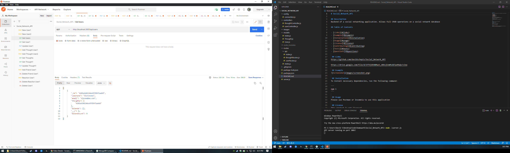

# Social_Network_API

## Description
Backend of a social networking application. Allows full CRUD operations on a social network database

## Table of Contents

- [Links](#links)
- [Example](#example)
- [Installation](#installation)
- [Usage](#usage)
- [License](#license)
- [Contributing](#contributing)
- [Tests](#tests)
- [Questions](#questions)

 ## Links
https://github.com/davidschepis/Social_Network_API

Part1:

https://drive.google.com/file/d/1hREa4dhzQxDrNTNX3puc2RBcSJ4GzdSb/view

Part2:

https://drive.google.com/file/d/1DyvwcPIxS5kCNyzbtr3RlpU9kT9NsNgf/view

 ## Example


 ## Installation
To install necessary dependencies, run the following command:

```
npm i
```

 ## Usage
Please use Postman or Insomnia to use this application

 ## License
This project is not licensed

 ## Contributing
Please contact me if you with to contribute

 ## Tests
To run tests, run the following command:

```
There are no tests for this application
```

 ## Questions
Please contact me at [davids.developer@outlook.com](mailto:davids.developer@outlook.com) with any questions.
Github Repo: [davidschepis](https://github.com/davidschepis).
